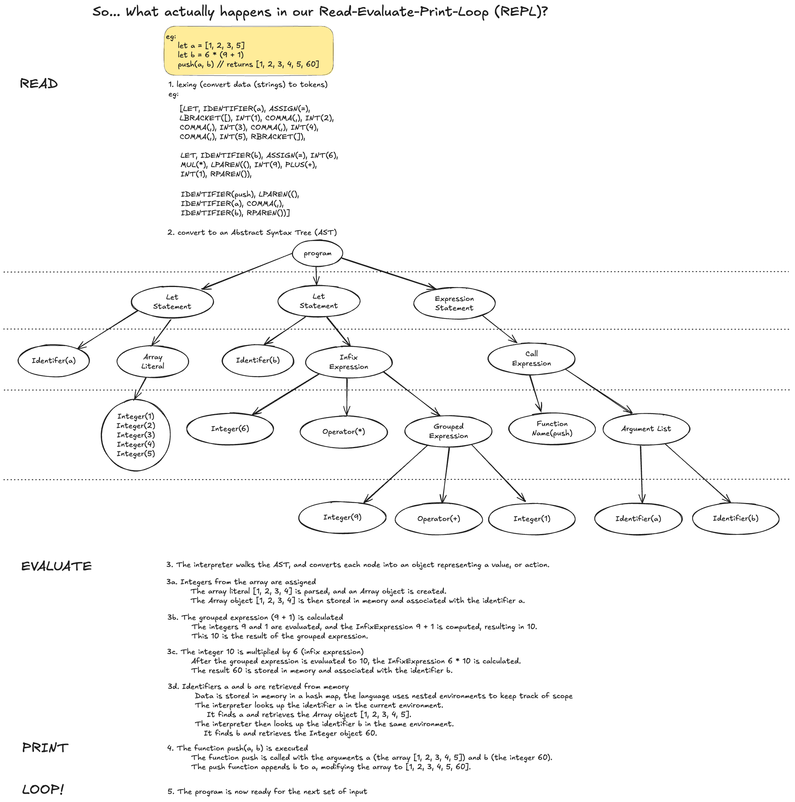

# go-interpreter

### Challenges set in book:

#### Lexing

- [ ] lexer attaches the line number, column number and filename to a token
- [ ] support more than just ASCII (ie, unicode and utf-8, emojis, etc)
- [ ] support floats, hex, octal, and any numbers that are not strict integers

#### Parsing

- [ ] postfix operators (eg, foobar **++** )

#### Evaluation

- [ ] Boolean operands - adding, subtracting, dividing and multiplying booleans, checking whether true is greater than false with < or >.
- [ ] Add stack trace to error object

#### Data Structures

- [ ] readString reports an error instead of simply returning when it reaches the end of the input.
- [ ] Add support for character escaping so that string literals like "hello \"world\"", "hello\n world" and "hello\t\t\tworld" work"
- [ ] Implement technique (separate chaining, or open addressing) to prevent hash collision
- [ ] optimise performance of the HashKey() method by caching their return values

#### Macros

// broadly the book skips over error handling and debugging support for macros
- [ ] error handling for `ast.Modify`
- [ ] move token construction, and implement error handling for `convertObjectToASTNode` during quote / unquote macro
- [ ] proper modification of AST nodes - ast.Modify modifies child nodes, but doesn’t update the Token fields of the parent nodes
- [ ] nested macro functions

### Long term project challenges:

- [x] complete mvp of product as outlined in book
- [x] complete the [lost chapter](https://interpreterbook.com/lost/)
- [ ] implement all additional features discussed in book
- [ ] honestly i'm not a huge fan of _monkeys_ so maybe i'll rewrite this interpreter to be for a language named after my cat _misha_
- [ ] once above complete, check out the authors follow up book on [writing a compiler](https://compilerbook.com/).

#### Reflections:

  
 Written after chapter one:

Early days so far, but...

I’m working through _Writing An Interpreter In Go_ as part of my broader journey in CS. I've almost exclusively worked with interpreted, dynamically typed languages (python, and js), so this book helps both:

- increase my understanding of what is happening with the languages I use
- gives me exposure to working with a compiled, statically typed language

Building an interpreter will not only sharpen my problem-solving and system design skills but also provide me with insights into language constructs and execution models - that's the hope at least 😅

At the very least, tackling this project is a way to peel back the layers and explore what happens beneath the surface when code is executed. The interpreter lets me see the immediate effects of my decisions, making it easier to grasp core concepts like parsing, tokenization, and evaluation.

##### Written after completing the book:
After completing both Writing an Interpreter in Go (and The Lost Chapter), I now feel I have a much deeper understanding of language design and implementation. These books have taken me beyond just the theoretical knowledge of lexing, parsing, and evaluation to a more practical application of those concepts through real code implementation. I began this project with a goal of demystifying the process of how interpreters work, and it has achieved that and more.

Before starting the book if you had have asked me how an interpreted language works, I would have given a fairly vague answer of:
> "It reads and executes the code line by line"

Now, my answer would look more like so:

> tl;dr "It reads and executes the code line by line"

But now I *understand* what that involves.

Building an interpreter for the Monkey language in Go not only gave me insights into the internal workings of the languages I use daily but also made the relationship between interpreted and compiled languages clearer. Although Go is statically typed, working on the interpreter helped bridge the gap between the dynamic, interpreted world I was used to and the more rigid structure of compiled languages. I’ve gained a new appreciation for type systems, error handling, and how these mechanisms can be applied or abstracted in different languages.

I also hadn't used macros in any language before, so getting exposure to a system similar to Lisp or Elixir's was eye-opening. Being able to quote and unquote expressions dynamically, while ensuring proper traversal and modification of the AST, required a deeper understanding of both tree structures and meta-programming techniques.

Overall, this book served as an incredible point of reference for interpreted languages and their functionality, Go, and testing all in one. I can't wait to get started with the next book on writing a compiler - but first I want to finish up all the features in this interpreter. 

